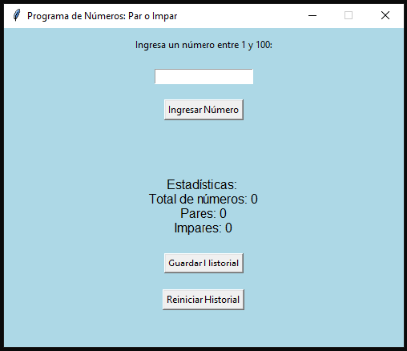

# Programa de Números: Par o Impar 🎲

Este proyecto es una pequeña aplicación gráfica en Python que permite al usuario ingresar números entre 1 y 100, identificando si son pares o impares. También muestra estadísticas en tiempo real y permite guardar el historial en un archivo `.csv`.

## 🖼️ Vista previa


## 🚀 Funcionalidades

- Verifica si un número es par o impar.
- Lleva el historial de los números ingresados.
- Muestra estadísticas:
  - Total de números
  - Cantidad de pares e impares
- Guarda el historial en un archivo CSV.
- Reinicia el historial con un botón.
- Interfaz gráfica intuitiva creada con `tkinter`.

## 🛠️ Tecnologías utilizadas

- Python 3
- Tkinter (interfaz gráfica)
- CSV (para almacenamiento)

## ▶️ Cómo ejecutarlo

1. Asegurate de tener Python instalado.
2. Descargá el archivo `.py` desde este repositorio.
3. Ejecutá el script con el siguiente comando:

```bash
python Numeros_Par_Impar.py
